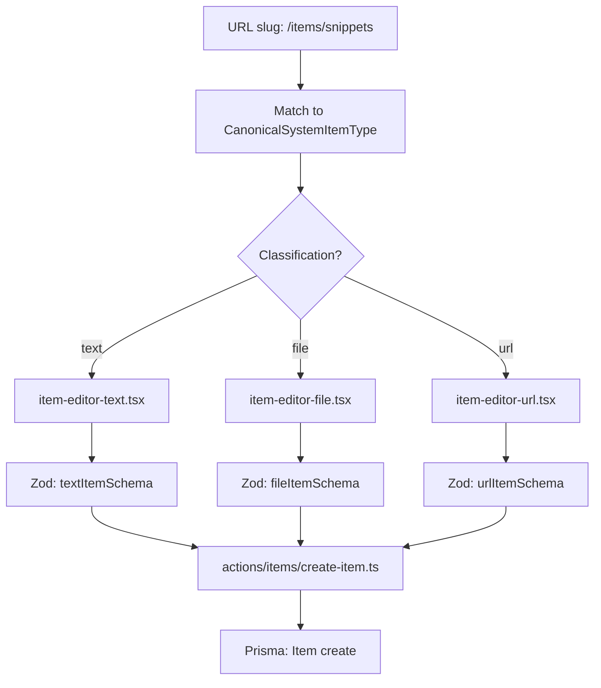

# Item CRUD Architecture

This document describes the proposed unified CRUD architecture for all 7 system item types in DevMemo. It is based on the current codebase patterns, the Prisma schema, and the canonical item-type definitions.

Source references:
- [`lib/item-types.ts`](../lib/item-types.ts) — canonical system item types
- [`lib/db/items.ts`](../lib/db/items.ts) — existing item queries
- [`prisma/schema.prisma`](../prisma/schema.prisma) — database model
- [`docs/item-types.md`](./item-types.md) — item type reference

---

## Design Principles

1. **One shared `Item` model** — all 7 system types use the same Prisma `Item` table. Type-specific behavior is driven by conventions and populated fields, not separate tables.
2. **Mutations in server actions** — create, update, delete live under `actions/items/`. One action file per mutation, shared across all types.
3. **Queries in `lib/db/`** — data fetching functions live in `lib/db/items.ts` and are called directly from server components.
4. **One dynamic route** — `/items/[type]` resolves via the slug generated by `getItemTypeHref()`. A single route handles all types.
5. **Type-specific logic in components, not actions** — the action layer is generic. Components adapt their UI and validation based on the item type key.

---

## File Structure

```
├── actions/
│   └── items/
│       ├── create-item.ts        # Server action: create any item type
│       ├── update-item.ts        # Server action: update any item type
│       ├── delete-item.ts        # Server action: delete an item
│       ├── toggle-favorite.ts    # Server action: toggle isFavorite
│       └── toggle-pinned.ts      # Server action: toggle isPinned
│
├── lib/
│   ├── db/
│   │   ├── items.ts              # Read queries (called from server components)
│   │   ├── collections.ts       # Collection queries (existing)
│   │   └── prisma.ts             # Prisma client singleton
│   ├── item-types.ts            # Canonical type definitions (source of truth)
│   └── validations/
│       └── item-schema.ts        # Zod schemas per item type classification
│
├── app/
│   └── items/
│       └── [type]/
│           ├── layout.tsx        # Shared layout: sidebar, breadcrumbs
│           ├── page.tsx          # List view for items of this type
│           └── [id]/
│               ├── page.tsx      # Detail/view page
│               └── edit/
│                   └── page.tsx  # Edit form
│
├── components/
│   └── items/
│       ├── item-form.tsx         # Shared form skeleton, accepts type config
│       ├── item-card.tsx         # Card for list/grid views
│       ├── item-editor-text.tsx  # Rich editor for text-backed types
│       ├── item-editor-file.tsx  # Upload UI for file-backed types
│       ├── item-editor-url.tsx   # URL input + preview for url-backed types
│       ├── item-detail.tsx       # Detail view, switches by classification
│       └── type-config.tsx       # Maps type key → UI config (fields, editor)
```

---

## Routing: `/items/[type]`

### Slug resolution

[`getItemTypeHref()`](../lib/item-types.ts) generates slugs from type names:

```
Snippets → /items/snippets
Prompts  → /items/prompts
Comandos → /items/comandos
Notas    → /items/notas
Archivos → /items/archivos
Imágenes → /items/imagenes
Enlaces  → /items/enlaces
```

The slug is derived by:
1. Normalizing to NFD, stripping diacritics (`í` → `i`, `é` → `e`)
2. Lowercasing
3. Replacing non-alphanumeric runs with `-`
4. Trimming leading/trailing dashes

### Route layout

| Route | Purpose |
|---|---|
| `/items/[type]` | List all items of that type |
| `/items/[type]/[id]` | View a single item |
| `/items/[type]/[id]/edit` | Edit a single item |

The `[type]` segment is matched against the slug of system and custom types. A `generateStaticParams` or dynamic lookup resolves the slug to an `ItemType` record.

### Type resolution in server components

```ts
// app/items/[type]/page.tsx (conceptual)
import { CANONICAL_SYSTEM_ITEM_TYPES } from '@/lib/item-types'

const typeMap = new Map(
  CANONICAL_SYSTEM_ITEM_TYPES.map(t => [
    t.href.replace('/items/', ''),  // slug → canonical type
    t
  ])
)

// In page: look up slug → get type config → pass to components
```

---

## Where Type-Specific Logic Lives

### Not in the action layer

Server actions are generic. `create-item.ts` validates the payload using a Zod schema that changes shape based on `contentType`, sends it to Prisma, and returns the result. The action does not branch on `typeId` beyond validation rules tied to the `contentType` classification.

### In the component layer

| Concern | Where it lives |
|---|---|
| Which fields to show in the form | `type-config.tsx` maps type key → field visibility |
| Which editor component to render | `item-form.tsx` selects `item-editor-text`, `item-editor-file`, or `item-editor-url` based on the item's classification |
| Validation rules per type | `lib/validations/item-schema.ts` exports three Zod schemas: `textItemSchema`, `fileItemSchema`, `urlItemSchema` |
| Type-specific labels and icons | `lib/item-types.ts` already provides `singularLabel`, `icon`, `color` |

### Classification → Editor mapping

| Classification | Types | Editor component | Key fields |
|---|---|---|---|
| Text-backed | Snippet, Prompt, Comando, Nota | `item-editor-text.tsx` | `content`, `language` |
| File-backed | Archivo, Imagen | `item-editor-file.tsx` | `fileUrl`, `fileName`, `fileSize` |
| URL-backed | Enlace | `item-editor-url.tsx` | `url` |

---

## Component Responsibilities

### `type-config.tsx`

Produces a runtime config object for each type key:

```ts
type TypeConfig = {
  key: SystemItemTypeKey
  label: string
  icon: string
  color: string
  classification: 'text' | 'file' | 'url'
  fields: (keyof ItemFormData)[]
  showLanguage: boolean
  showFileUpload: boolean
  showUrl: boolean
}
```

Each canonical type maps to exactly one config. Custom types fall back to a sensible default (text classification with all optional fields hidden).

### `item-form.tsx`

- Accepts a `TypeConfig` and optional `initialData` (for editing).
- Renders the correct editor sub-component based on `classification`.
- Handles shared fields: `title`, `description`, `tags`, `collectionId`.
- Calls the appropriate server action on submit.

### `item-editor-text.tsx`

- Renders a code/text area, optionally with syntax highlighting and language selector.
- Used by: Snippet, Prompt, Comando, Nota.

### `item-editor-file.tsx`

- Renders a file upload input (Cloudflare R2 integration).
- Shows file name and size after upload.
- Used by: Archivo, Imagen.

### `item-editor-url.tsx`

- Renders a URL input with optional link preview.
- Used by: Enlace.

### `item-card.tsx`

- Renders a card in grid/list views.
- Shows type icon and color from `AppItemType`.
- Conditionally shows `language` badge for text-backed items.

### `item-detail.tsx`

- Routes to the appropriate editor based on classification.
- Read-only view shows content or file/image/URL based on type.

---

## Server Actions

### `create-item.ts`

```ts
'use server'

// Validates input against the correct Zod schema (text/file/url)
// Sets contentType from classification
// Creates Item via Prisma
// Returns created item
```

All types share the same action. The Zod validation branch is determined by the `classification` property of the canonical type, not by the `typeId` directly.

### `update-item.ts`

```ts
'use server'

// Verifies ownership (userId match)
// Validates partial input
// Updates Item via Prisma
// Returns updated item
```

### `delete-item.ts`

```ts
'use server'

// Verifies ownership (userId match)
// Deletes Item via Prisma (cascades to ItemTag)
// Returns success
```

### `toggle-favorite.ts` / `toggle-pinned.ts`

```ts
'use server'

// Verifies ownership
// Toggles boolean field on Item
// Returns updated state
```

---

## Validation Schema

`lib/validations/item-schema.ts` defines three Zod schemas:

```ts
// Shared base
const baseItemSchema = z.object({
  title: z.string().min(1),
  description: z.string().optional(),
  typeId: z.string(),
  collectionId: z.string().optional(),
  tagIds: z.array(z.string()).optional(),
})

// Text-backed: snippet, prompt, command, note
export const textItemSchema = baseItemSchema.extend({
  contentType: z.literal('text'),
  content: z.string().min(1),
  language: z.string().optional(),
})

// File-backed: file, image
export const fileItemSchema = baseItemSchema.extend({
  contentType: z.literal('file'),
  fileUrl: z.string().url(),
  fileName: z.string().optional(),
  fileSize: z.number().optional(),
  language: z.string().optional(),
})

// URL-backed: url
export const urlItemSchema = baseItemSchema.extend({
  contentType: z.literal('text'),  // URL items use contentType "text" with content null
  url: z.string().url(),
  content: z.string().nullable().optional(),
})
```

> **Note**: In the current Prisma schema, URL items use `contentType: "text"` with `content: null` while the destination lives in the `url` field. See [item-types.md](./item-types.md) for details.

---

## Data Flow Diagram

```
┌──────────────────────────────────────────────────────────┐
│  Browser                                                  │
│                                                          │
│  /items/[type]         →  ItemList (server comp)         │
│                            │                             │
│                            ▼                             │
│                       lib/db/items.ts                    │
│                       (read queries)                     │
│                                                          │
│  /items/[type]/[id]    →  ItemDetail (server comp)       │
│                            │                             │
│                            ▼                             │
│                       lib/db/items.ts                    │
│                                                          │
│  ItemForm (client comp)                                  │
│       │                                                  │
│       ▼                                                  │
│  actions/items/create-item.ts                            │
│  actions/items/update-item.ts                            │
│  actions/items/delete-item.ts                            │
│                                                          │
└──────────────────────────────────────────────────────────┘
```

Reads flow directly through server components calling `lib/db/`. Writes go through server actions in `actions/items/`.

---

## Item Type Resolution Flow



---

## Custom Item Types

The architecture supports custom (user-defined) item types through the `ItemType` model:

- System types have `isSystem: true` and `userId: null`.
- Custom types have `isSystem: false` and a `userId`.

When a custom type is encountered, the component layer falls back to a default classification (text) and renders the text editor. The route `/items/[type]` works for custom type slugs too, provided the user owns that type.

Custom type creation and management is a Pro-phase feature and is not part of the MVP CRUD scope.

---

## TODO / Not Yet Implemented

The following are planned but not yet in the codebase:

- [ ] `actions/items/` directory and action files (`create-item.ts`, `update-item.ts`, `delete-item.ts`, `toggle-favorite.ts`, `toggle-pinned.ts`)
- [ ] `lib/validations/item-schema.ts` — Zod validation schemas
- [ ] `app/items/[type]/` route with `layout.tsx`, `page.tsx`
- [ ] `app/items/[type]/[id]/` route for detail and edit pages
- [ ] `components/items/` directory with type-config, form, editors, card, detail
- [ ] File upload integration with Cloudflare R2 for file-backed types
- [ ] Syntax highlighting for snippet and command text editors
- [ ] URL preview/metadata fetcher for url-backed types
- [ ] Tag management UI within item forms (select existing, create new)